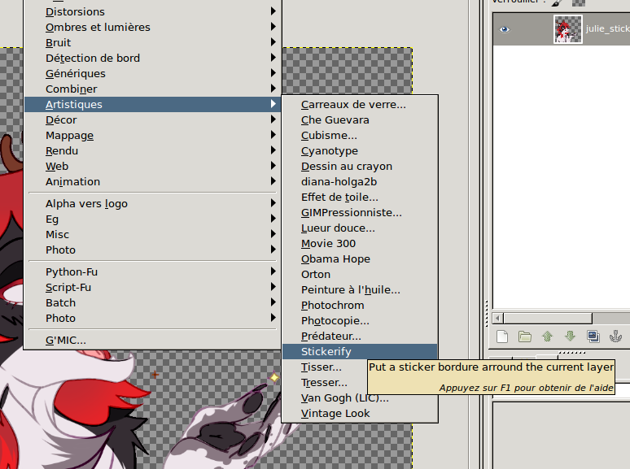

Introduction
============

Stickery is a GIMP plugin that puts a bordure arround the current layer to
"stickerify" it by putter a bordure arround it.

It's meant for creating Telegram stickers (and also an excuse to try to write a
plugin because fun.)


Usage
=====

The plug is located in Filter > Artistic > Stickerify



And provide the following options:


Installation
============

For gimp 2.8, haven't tested on other versions but it should work too.

```bash
sudo apt install gimp-python
git clone https://github.com/Psycojoker/sticker_bordure
cd stickers_bordure

# local install
mkdir -p ~/.gimp-2.8/plug-ins/
ln -s $(pwd)/stickers_bordure.py ~/.gimp-2.8/plug-ins/

# global install
sudo ln -s $(pwd)/stickers_bordure.py ~/usr/lib/gimp/2.8/plug-ins/
```

Licence
=======

wtfpl
